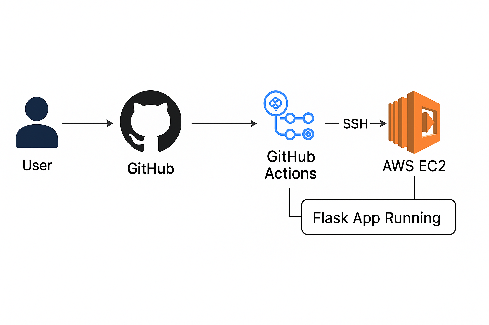
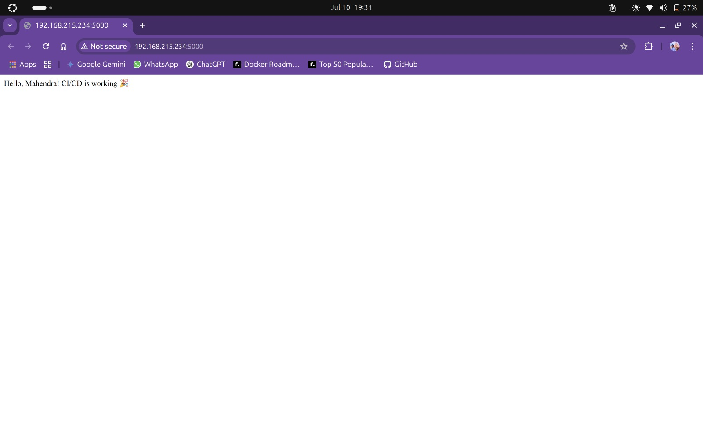
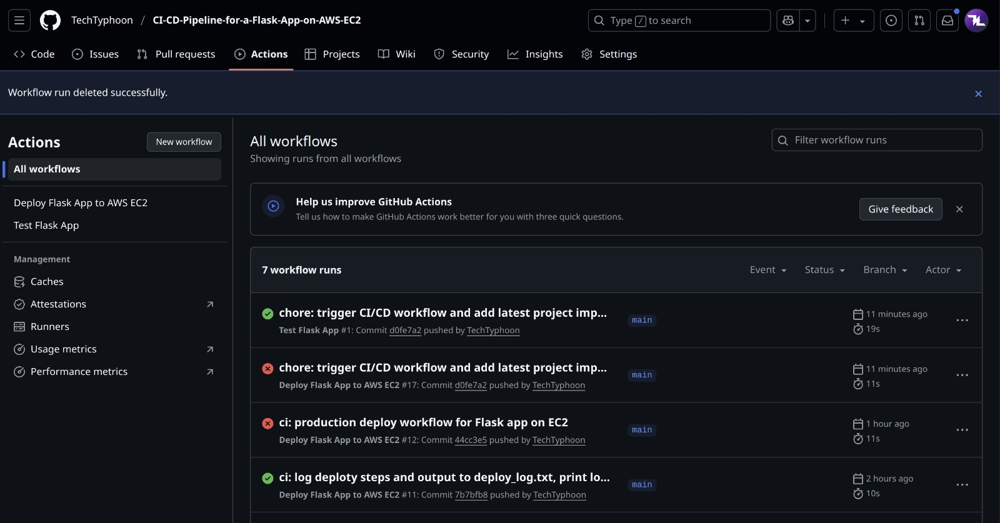

<p align="center">
  
  
  
  
</p>

<h1 align="center">CI/CD Pipeline for Flask App on AWS EC2</h1>

<p align="center">
  ⚙️ Fully automated CI/CD pipeline with GitHub Actions, Docker, Gunicorn, and AWS EC2. <br>
  🚀 Production-ready. Open-source. Scalable. Resume-worthy.
</p>

---

## 🚀 TL;DR

A **Flask web app** that automatically tests and deploys to an **AWS EC2** instance using **GitHub Actions**, with **Docker**, **Gunicorn**, **systemd**, and **log rotation**. Built for speed, reliability, and DevOps skill showcase.

---

## 🌟 Features

- ✅ Fully Automated CI/CD (GitHub Actions)
- 🐳 Dockerized + Docker Compose support
- 🖥️ AWS EC2 Production Deployment
- 🔥 Gunicorn + systemd + logrotate
- 💉 Health Check Endpoint (`/health`)
- 🧪 Pytest-based Testing
- 📦 Secure Deploy via SSH Key Secrets
- 📈 Uptime Monitoring via `uptime.sh`

---

## 🧰 Tech Stack

- Python 3.11 / Flask
- Docker + Docker Compose
- Gunicorn (WSGI Server)
- GitHub Actions (CI/CD)
- AWS EC2 (Ubuntu)
- systemd + logrotate
- SSH Key Authentication
- pytest

---

## 🔐 GitHub Secrets Required

| Secret Key      | Description                          |
|-----------------|--------------------------------------|
| `AWS_HOST`      | Public IP of your EC2 instance       |
| `AWS_USERNAME`  | Usually `ubuntu`                     |
| `AWS_SSH_KEY`   | Your private `.pem` key content      |

---

## 🛠️ Local Development


```bash
git clone https://github.com/TechTyphoon/CI-CD-Pipeline-for-a-Flask-App-on-AWS-EC2.git
cd CI-CD-Pipeline-for-a-Flask-App-on-AWS-EC2
python3 -m venv venv
source venv/bin/activate
pip install -r requirements.txt
python app.py
```

### 🐳 Docker Deployment
```bash
docker build -t flask-cicd-app .
docker run -d -p 5000:5000 --restart always --name flask-cicd-app flask-cicd-app
```

### Or with Compose
```bash
docker-compose up -d
```

### ☁️ EC2 Production (Non-Docker)
```bash
chmod +x setup.sh
./setup.sh
```
Gunicorn service: `gunicorn-flask.service`
Logs: `/var/log/gunicorn/output.log`
Logrotate: `gunicorn-logrotate`

---

## 🤖 GitHub Actions CI/CD Workflow
On Push to main:
- ✅ Runs pytest
- ✅ Connects to EC2 via SSH
- ✅ Copies files securely
- ✅ Installs dependencies
- ✅ Restarts the Flask app via systemd

## 🧪 Health Check
- Endpoint: `/health`
- Returns: `200 OK` if app is healthy
- Used In: GitHub Actions, `uptime.sh`, and Docker `HEALTHCHECK`

## 📸 Screenshots
| Architecture Diagram | Deployed App | CI/CD Pipeline Flow |
|---|---|---|
|  |  |  |

## 🤝 Contributing
We welcome PRs and issues! See [CONTRIBUTING.md](CONTRIBUTING.md)

## 📜 License
This project is licensed under the MIT License.

## 👤 Author
Made with ❤️ by Mahendra Reddy  
🔗 [GitHub](https://github.com/TechTyphoon) | [LinkedIn](https://www.linkedin.com/in/your-linkedin)

## 📣 Share It!
⭐ Star the repo  
🔄 Fork it  
📢 Share with #DevOps, #AWS, #CI/CD on LinkedIn and Twitter
